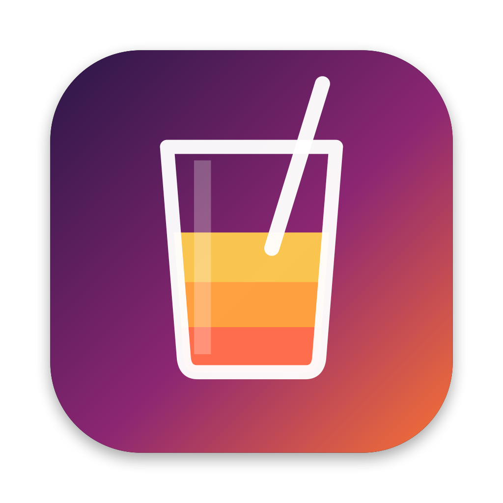
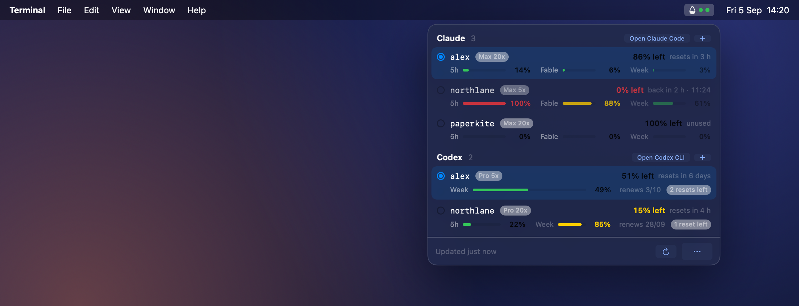

<p align="center"></p>

<h1 align="center">VibeJuice</h1>

<p align="center">Switch Claude Code, Codex and Grok accounts in one click. Keep coding.</p>

<p align="center"></p>

VibeJuice is a menu bar switcher for your AI coding accounts. When the account you are on runs out of juice, pick another one and keep going. No sign-out, no `/login` dance, no config editing. Every new `claude`, `codex` or `grok` you start uses the account you picked, exactly as if you had logged in with it.

The quota meters are there so you know when to switch, not the other way round. Each account shows its session, weekly and per-model windows with reset times, and auto-switch can flip to the account with the most headroom the moment the active one hits a limit.

No proxy. Nothing sits between the CLI and the API. Each login is kept in the app's own Keychain vault and copied into the place the CLI reads from when you pick it. Quota comes from the same endpoints the CLIs call for `/usage`.

## Install

Requires macOS 26 or newer and at least one of Claude Code, Codex CLI or Grok CLI already signed in.

**Homebrew**

```sh
brew install --cask samuelpatro/tap/vibejuice
```

**Download**

Grab the DMG from [Releases](https://github.com/samuelpatro/vibejuice/releases), drag VibeJuice to Applications. The build is not notarized yet, so macOS blocks the first launch. Clear the flag once and it opens normally:

```sh
xattr -dr com.apple.quarantine /Applications/VibeJuice.app
```

The Homebrew cask does this for you.

**From source** (needs Xcode 26)

```sh
git clone https://github.com/samuelpatro/vibejuice.git
cd vibejuice
scripts/make-signing-cert.sh   # once: self-signed identity so Keychain permission sticks across builds
scripts/bundle.sh              # builds build/VibeJuice.app and opens it
```

The app sits in the menu bar as a small glass. Its fill level is the headroom of your active accounts, and a bolt joins it when a weekly window with unused quota is about to reset. The … menu has toggles for launch at login and for showing the percent next to the glass. When a newer release is out, the footer shows it with a link.

## Release

Push a tag and GitHub Actions builds the DMG on a macOS 26 runner, publishes the GitHub Release, and updates the cask in [homebrew-tap](https://github.com/samuelpatro/homebrew-tap).

```sh
git tag v0.3.0
git push origin v0.3.0
```

The workflow needs one secret, `TAP_TOKEN`, a fine-grained token with Contents read and write on `homebrew-tap`. `scripts/release.sh <version>` runs the same pipeline locally.

## Accounts

The account currently signed in to each CLI is picked up automatically. To add another one, press **+** in its section. Terminal opens with `claude auth login` or `codex login`, you sign in, and on the next refresh the new login sits next to the old one.

Click a row to switch. Sessions already running keep their old account, so VibeJuice offers to restart them: each one is closed and reopened with its resume command, in the folder and the terminal it was running in (cmux, Ghostty, iTerm or Terminal). Right-click a row to refresh it, spend a Codex manual reset, or forget it.

**Auto-switch** (in the … menu) moves to the account with the most headroom as soon as the active one hits a limit, and posts a notification. Independently of that, one notification goes out when an active account drops under 10% on any window.

## What the numbers mean

- **Claude**: the same windows `/usage` prints. Session is the 5-hour limit, Week is all models, and the model-scoped week is labeled with the model name Anthropic reports. Percent is used, the row shows how much is left.
- **Codex**: the weekly limit, the plan (Pro 5x, Pro 20x, Plus, Team), the renewal date, and how many manual resets remain. The login is read from `auth.json`, or from the Keychain when `cli_auth_credentials_store` is `keyring` or `auto` in `~/.codex/config.toml`. In that case macOS may ask once whether `security` may read the "Codex Auth" item; choose Always Allow.
- **Grok**: accounts and switching only for now. Grok has no known usage endpoint, see [#1](https://github.com/samuelpatro/vibejuice/issues/1).
- Only the active account's token is refreshed by its CLI. An inactive account shows "Token expired" once its access token lapses. Switch to it and start the CLI once to refresh it.

## Development

- `~/Library/Logs/VibeJuice/app.log` records load steps with status codes only.
- `~/Library/Logs/VibeJuice/*-usage.json` holds the shape of provider responses, keys and numbers, no tokens.
- `open --env VIBEJUICE_DEBUG_WINDOW=1 build/VibeJuice.app` also shows the popover as a normal window.
- `scripts/make-icon.swift` draws the icon; `prototype-dashboard.html` is the original design prototype.
